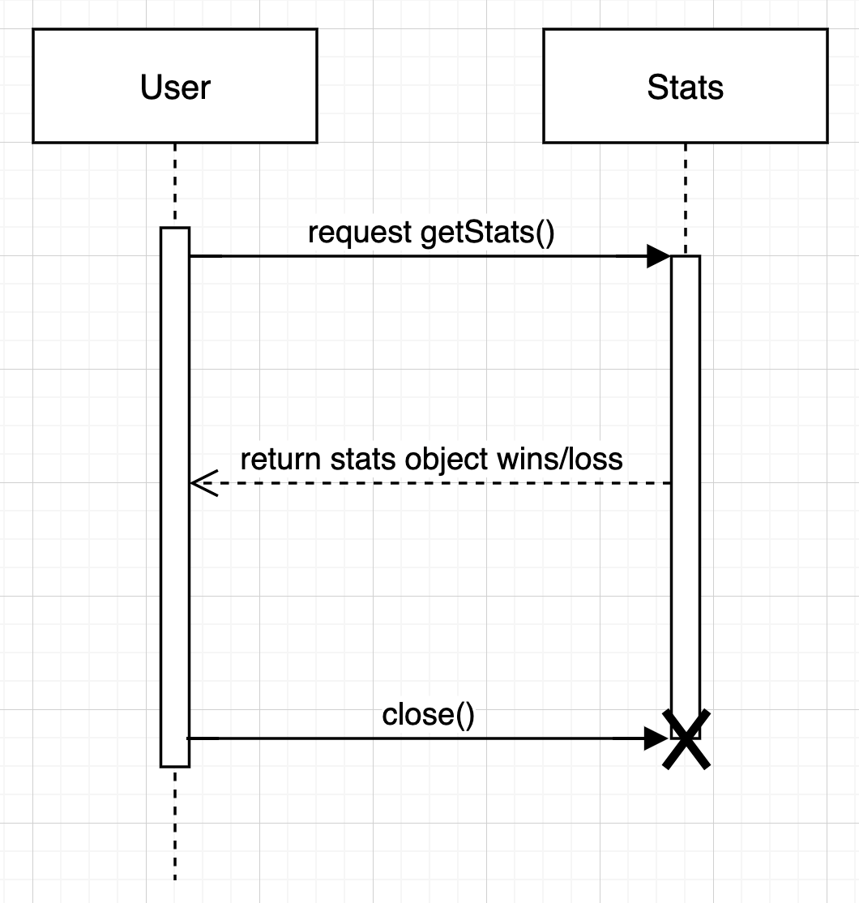

# How to Use the Microservice

Make sure node is already installed, then paste the following command into the terminal within the Blackjack_Stats folder:
 ```
 npm install
 ```
Dependencies will be installed automatically. Start your service by issuing the subsequent command:

 ```
 nodemon blackjack-stats-service.js
 ```
If the server startup was successful, your terminal will display a message saying `Blackjack Stats Service is listening on http://localhost:3000/win/loss`


## Endpoints
To view the database's response detailing the aggregate win/loss record, point your browser to "http://localhost:3000/win/loss."

### Example of how to REQUEST data:
```
const apiURL = 'http://localhost:4000/win/loss';

const getBlackJackStats =  async () => {
  const response = await fetch(apiURL);
  if (response.ok) {
    const data = await response.json();
    console.log('Data: ', data);
  }
}
```

### Example of the response:
```
[
    {
        id: 1,
        title: "Wins",
        count: 86
    },
    {
        id: 2,
        title: "Loss",
        count: 86
    }
]
```
## UML sequence diagram



### More resources

[](https://youtu.be/PCAu6ujaMkM)